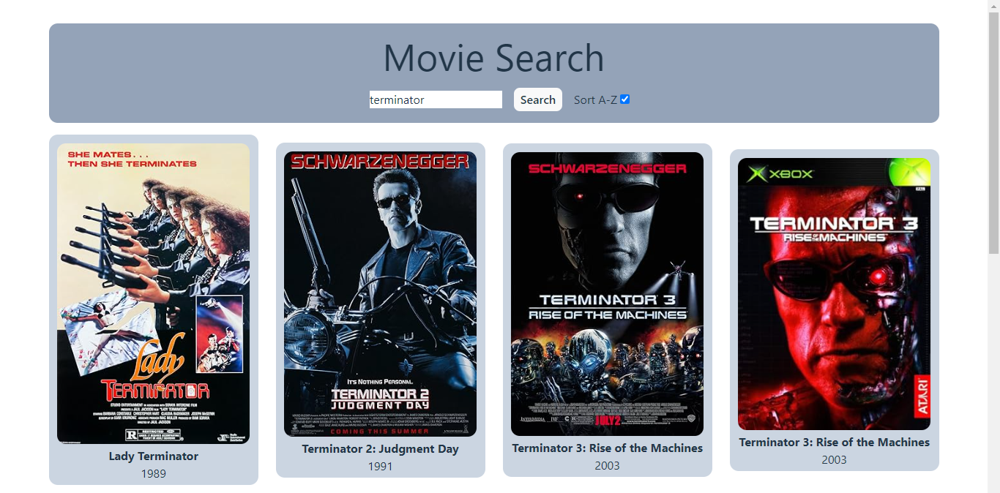

# Technical test for React Juniors

## Description

Create an app to search for movies.

### APIs

- https://omdbapi.com/
- API key needed

### Requirements

✅ It should have an input and a button to search for a movie. 
✅ Display the matching movies showing their title, year and poster. 
✅ Make the matching movies grid responsive. 

First iteration:

✅ Avoid the same search to trigger again when clicking the button, if the input has not changed. 
✅ Automatically trigger the search when typing. 
✅ Avoid the search to show previous results when finished typing (debounce). 

## Implementation

In this technical test I set up two custom hooks, one for handling the movies data, and another for the input validation logic. Inside the movies hook, I used useRef to avoid refetching when the input value is the same, useMemo to sort only when either the checkbox or the movies change, and useCallback to avoid utility functions from being created each time inside the custom hook.

## Technologies

* Languages: HTML, CSS, JavaScript, TypeScript
* Frameworks: React
* Other tools: Tailwind CSS, just-debounce-it